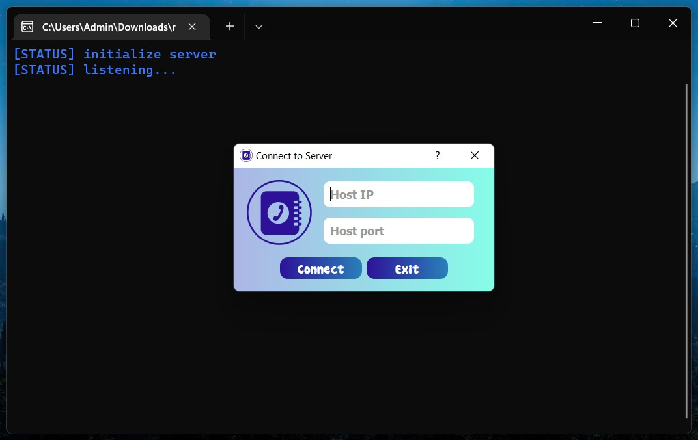
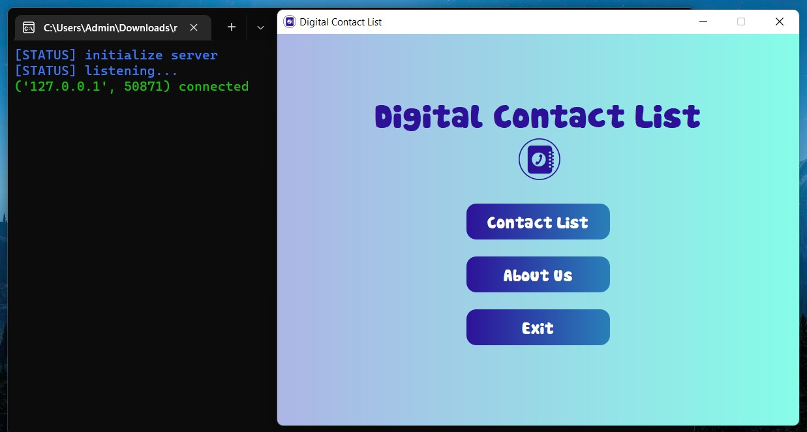
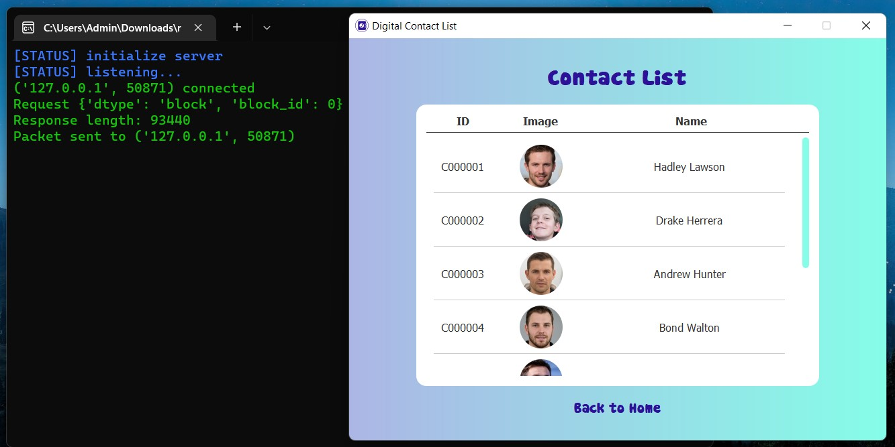
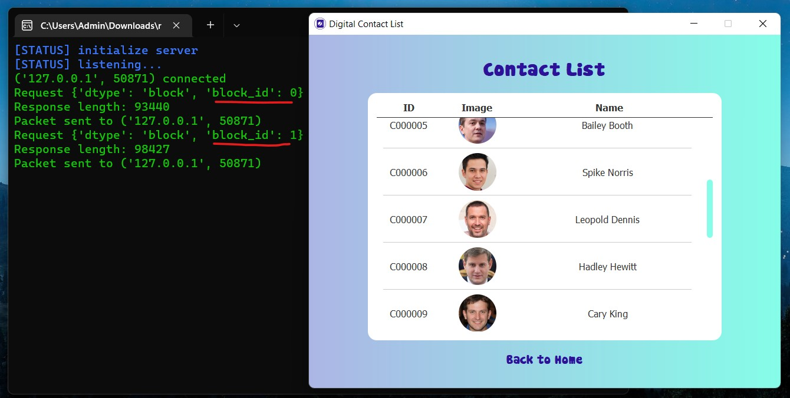
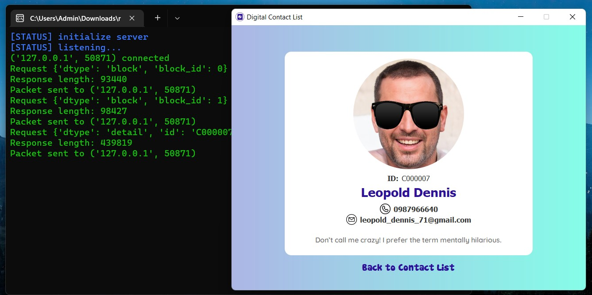
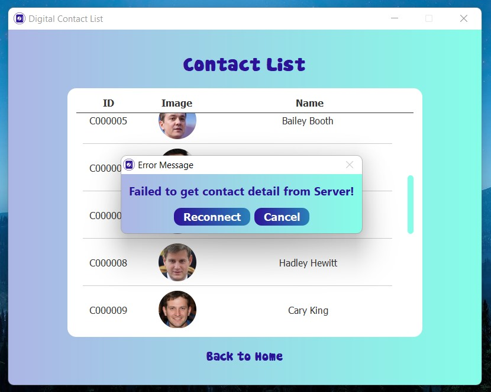
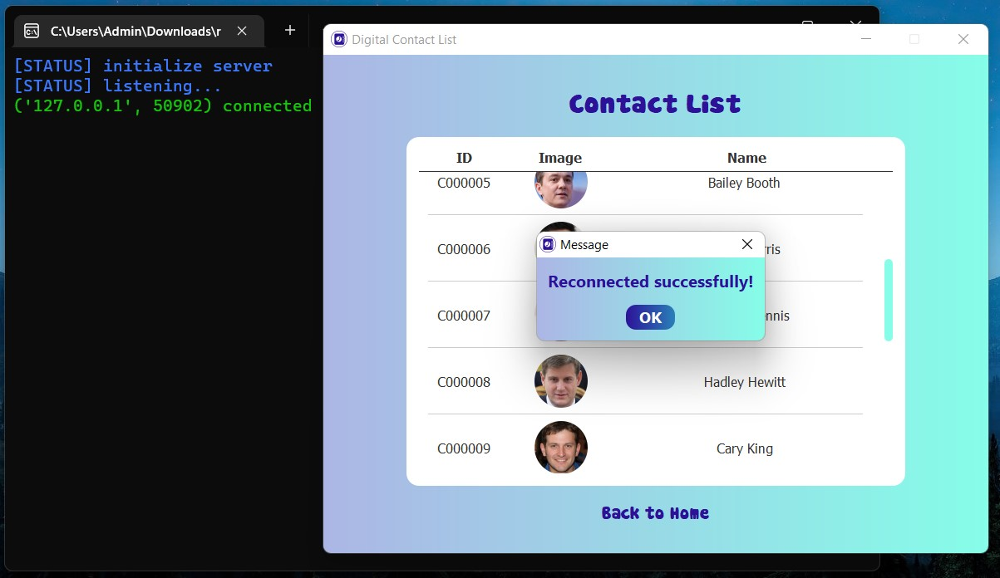
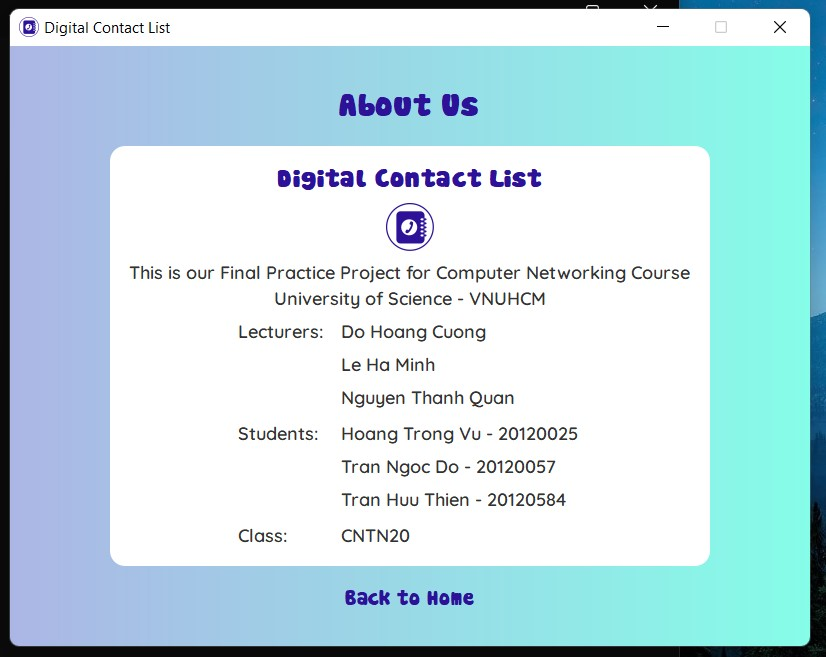

# Contact list with Socket

We are from [fit@hcmus](https://www.fit.hcmus.edu.vn/vn/), and this is our practice project for Computer Networking course (CSC10008). 

Our app manages a digital contact list using Socket programming, with TCP at Transport Layer. This contact list is stored at server side, and the server provides services for clients that they can request for contact information.

<span style="font-weight: bold;">Content:</span>
<ul>
    <li><a href="#try-our-app">Try our app</a></li>
    <li><a href="#build-app">Build the app from source codes</a></li>
    <li><a href="#screenshots">Screenshots</a></li>
</ul>

## 1. Try our app
<h5 id="try-our-app"></h5>

Get the lastest version of our app by following these steps
```bash
curl -fsSL github.com/htrvu/contact-list-with-socket/releases/latest/download/DigitalContact.zip -O
unzip -q DigitalContact.zip -d DigitalContact
```


## 2. Build the app from source codes
<h5 id="build-app"></h5>

Firstly, you must have `pyinstaller` installed. Then, follow these steps:

### 2.1. Clone this repository
```bash
git clone https://github.com/htrvu/contact-list-with-socket.git DigitalContact
cd DigitalContact
```

### 2.2. Build the source codes
#### a. Client
```bash
cd ./source/client # path to client folder
pyinstaller main.spec
```

#### b. Server
```bash
cd ../server # path to server folder
pyinstaller main.spec
```

#### c. Remove unnecessary stuffs
```bash
cd .. # path to source folder
mv client/dist/DigitalContact.exe client/DigitalContact.exe
mv server/dist/DigitalContact-Server.exe server/DigitalContact-Server.exe
rm -r client/dist client/build server/dist server/build
```

## 3. Screenshots
<h5 id="screenshots"></h5>
Starting the Server and input dialog of Client:

Client connects to Server:

View the contact list:

Infinte scroll for contact list:

View the detail information:

Client reconnects to Server:

Reconnect successfully:

About us:



